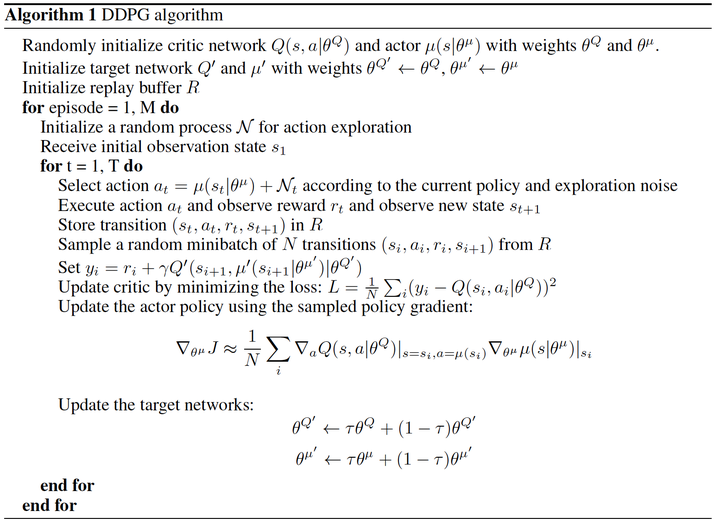

[//]: # (Image References)

[image1]: https://user-images.githubusercontent.com/10624937/43851024-320ba930-9aff-11e8-8493-ee547c6af349.gif "Trained Agent"
[image2]: https://user-images.githubusercontent.com/10624937/43851646-d899bf20-9b00-11e8-858c-29b5c2c94ccc.png "Crawler"

# Project 2: Continuous Control

### Introduction

#### Environment
This project uses the [Reacher](https://github.com/Unity-Technologies/ml-agents/blob/master/docs/Learning-Environment-Examples.md#reacher) environment.

![Trained Agent][image1]

In this environment, a double-jointed arm can move to target locations. A reward of +0.1 is provided for each step that the agent's hand is in the goal location. Thus, the goal of the agent is to maintain its position at the target location for as many time steps as possible.

The observation space consists of 33 variables corresponding to position, rotation, velocity, and angular velocities of the arm. Each action is a vector with four numbers, corresponding to torque applicable to two joints. Every entry in the action vector should be a number between -1 and 1.

#### Multi-Agent
The environment is also available as multi-agent environment where in each time step 20 different agents can be interacted with.
The rewards over time steps are accumulated per agent. 
We use this version (as opposed to the single agent environment) to solve the challenge.

#### Goal of the Challenge

The trained agent must get an average score of +30 over 100 consecutive episodes.
In case multiple agents are used (the multi-agent environment) the score per episode is the mean score over all agents. 

The environment is considered solved, when the average (over 100 episodes) of those average scores is at least +30. 

## Getting started

Detailed instructions to get the environment properly set up with the right Python version and dependencies is provided in the Jupyter notebook Continuous_Navigation.ipynb.
They include setting up the python environment with dependencies and the Unity environment. 

## Instructions
Make sure to run the Jupyter Notebook server from the repository root. This way the needed packaged "module" can be imported.

To train the agent simply follow the instructions inside the Continuous_Navigation.ipynb. 

## Sample output
The Report.html is a report showing the results obtained when solving the challenge.
The trained agent checkpoint files are found under [trained_models/](trained_models)

## Implemented Solution and Lessons Learnt
We use the multi-agent environment explained above. However, there is only one policy trained which interacts with all environments to collect experiences.

As an algorithm we use Deep Deterministic Policy Gradient (DDPG). While sometimes referred to as an Actor-Critic method it is distinctly different in that 
the actor does not compute a probability distribution over the action space but rather outputs a discrete action value being
its prediction of the action that would maximize the action-value function Q(s,a). The critic validates this choice. Concretely,
it is used as cost function with which the actor network is trained. Hence, the higher the expected returns (as estimated in Q(s,a)) is
the higher the selected action is reinforced and vice versa.

Similar in DQN (Deep Q-Network) a pair of networks is used for each predictor, namely local_actor and target_actor as well as
local_critic and target_critic. The target networks are kept fairly fixed and updated slowly whereas the local networks are trained to match the targets.

In performing DDPG the following steps have to be performed:
- predict the best action to chose a_{predictedTarget} using the **target_actor** network
- determine the TD error in Q function by computing reward + \gamma*Q_{target}(s_{next},a_{preditedTarget})-Q_{local}(s,a_{predictedTarget}) 
and using this as loss function for the **local_critic** to improve its predictability.
- use the Q_{local}(s,a_{predictedLocal}) where a_{predictedLocal} is the predicted best action by **local_actor** as cost function for updating the local_actor
- finally, blend in a fraction of local model weights into their target peers.

A more formal explanation of the algorithm is described in the pseudo code below

while having the following minor modification:
- In each time step all 20 agents update the experience buffer.
- After every time_steps_before_training (in solution set to 20) we perform num_trainings_per_update (in solution set to 20) backpropagation passes to update the actor and critic.
  
In solving the challenge different ideas were tested. They are listed below:

|Num| Idea | Rationale |Usefulness |
|---|-----|--------------|----------|
|1|Setting target equal to local model (actor and critic) after every **episodes_to_make_target_equal_to_local** episodes|The soft update does not ensure that over long time the target becomes equal to the local model. In DQN this is usually done.| No significant improvement or degradation|
|2|Resetting the experience replay buffer every pre-defined number of episodes | Since the replay buffer is fairly large it will have very outdated samples in it. The idea is that as training progress we get new experience in. This inspired by human learning where a human learns more from recent experiences.| No significant improvement or degradation |
|3|Increasing the number of repeated training iterations (forward-backward passes) every **num_episodes_to_increase_num_trainings** episodes|As the training progresses and the agent becomes more confident (and the learning curve stable) it can increase its learning rate| No significant improvement to learning while significantly increasing the learning time|

For idea 3 it is worth mentioning that this also ensures setting the target model params equal to the local params at initialization.
This step is part of the original DDPG algorithm and forgotten in the reference code by Udacity as nicely pointed out by one of the course participants in the [forum](https://knowledge.udacity.com/questions/98687).

### Ideas for the Future
We also implemented one policy per agent. While it did train the results were not significantly better than the single 
 policy solution. However, that was before the final configuration was found with which the challenge was solved.
 Further analysis can be devoted to this solution. It is in the branch multi_agent_multi_policy. In particular the changes from master need to be merged and a strategy for resetting all policies to be equal every number of episodes based on performance can be investigated.

 
## Final notes
The submitted code builds upon the baseline notebooks and python files provided by Udacity.